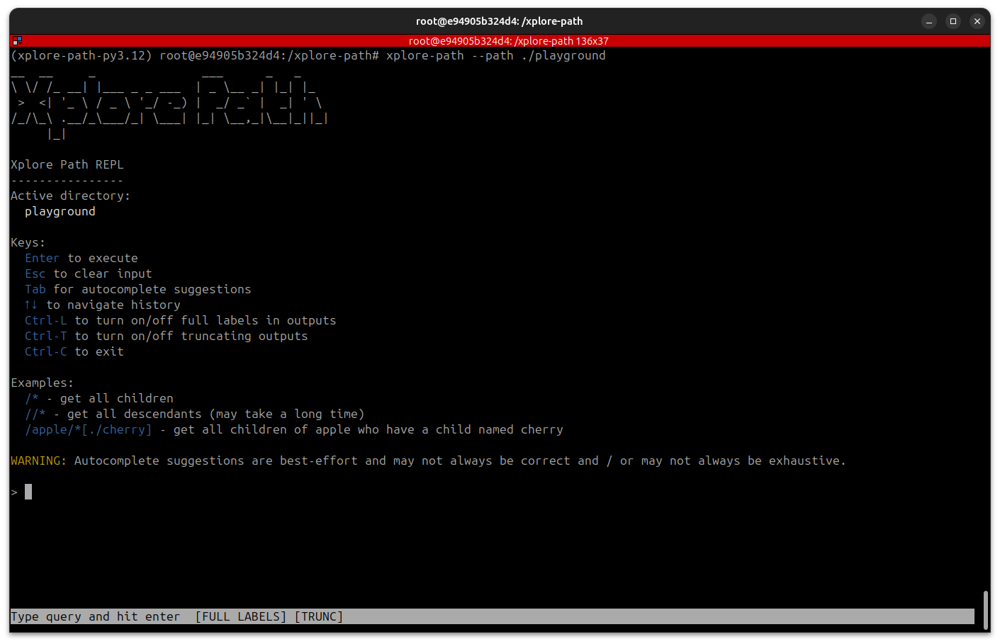

# Xplore Path

Xplore Path is a tool for quick-and-dirty data exploration, built for messy, untidy data scattered across disparate files and formats.

 * **Simple syntax**: Query data with an intuitive, XPath-like syntax.
 * **Broad format support**: Search through CSVs, XLSXs, JSONs, YAMLs, DOCXs, PDFs, XMLs, HTMLs, ...
 * **Fuzzy search support**: Search using globs, regex, number ranges, or approximate string matching.
 * **Unified environment**: Search through disparate files and formats within a single context.
 * **Extendable**: Add functions and formats to customize to your use case (e.g. 3D scene graphs, flow cytometry, ...).

Xplore Path aims to be the first tool you reach for when inspecting / exploring new data "thrown over the fence" by a colleague or partner. It does not aim to be a database or a storage engine.

  
:warning: Xplore Path is not a database :warning:

  Xplore Path does not index data, optimize storage, or optimize queries as a traditional database does. Xplore Path works best when doing quick-and-dirty inspection / exploration on reasonable amounts of data.

## Quick-Start Guide

The easiest way to get familiar with Xplore Path is to jump right in:

1. `python --version && pip install poetry` - Ensure Python and Poetry are installed.
2. `git clone https://github.com/offbynull/xplore-path.git` - Clone the repository.
3. `cd xplore-path` - Enter the cloned repository.
4. `poetry install` - Install the package.
5. `poetry shell` - Activate the package's environment. 
6. `xplore-path --path ./playground` - Launch the Xplore Path REPL.

The last step launches the Xplore Path REPL and sets the active directory to `./playground`, which contains dummy data (a mix of fabricated biological and general-purpose data).

Queries use a syntax inspired by XPath, where the start of the hierarchy is the `./playground` directory. Try running a few of the example queries shown below.

Example queries

* `/*` - List top-level files.
* `//*` - List all data.
* `/mouse_assays.zip/*` - List mouse assays.
* `/mouse_assays.zip/Mouse_Assay_001.csv//*` - List first mouse assay's data.
* `/mouse_assays.zip/r'.*001.csv'//*` - List first mouse assay's data, but using regex to identify the first assay.
* `/mouse_assays.zip/g'*001.csv'//*` - List first mouse assay's data, but using glob to identify the first assay.
* `/goslim_mouse.json//*` - List mouse gene ontology entries.
* `/goslim_mouse.json//*[./meta//val = g'*neuro*']//*` - List mouse gene ontology entries related to neuro.
* `/goslim_mouse.json//*[./meta//val = g'*neuro*']//id` - List mouse gene ontology entries related to neuro, ids only.
* `/goslim_mouse.json//*[./meta//val = g'*neuro*']//lbl` - List mouse gene ontology entries related to neuro, labels only.
* `/goslim_mouse.json//*[./meta//val = g'*neuro*']//(id, lbl)` - List mouse gene ontology entries related to neuro, ids and labels.
* `/goslim_mouse.json//*[./meta//val = g'*neuro*']//r'id|lbl'` - List mouse gene ontology entries related to neuro, ids and labels using regex.

Example queries with filtering

* `/mouse_assays.zip/*[.//g'*Gene*' = g'*Cd40*']` - List mouse assays targeting gene Cd40.
* `/mouse_assays.zip//*/GO_Term[. = g'GO:*']` - For each mouse assay, list the gene ontology terms used.
* `/goslim_mouse.json//*[./meta//val = g'*neuro*']//id` - List mouse gene ontology related to neuro, cleaned ids only.

Example queries fed into function

* `$count(/*)` - Count top-level files.
* `$distinct(/mouse_assays.zip//*/GO_Term[. = g'GO:*'])` - Across all mouse assays, list distinct gene ontology terms used.
* `$frequency_count(/mouse_assays.zip//*/GO_Term[. = g'GO:*'])//*` - Across all mouse assays,  count how often each gene ontology term appears.
* `$regex_extract(/goslim_mouse.json//*[./meta//val = g'*neuro*']//id, '\d{7}')` - List mouse gene ontology related to neuro, cleaned ids only.

Example queries with joins

* `($distinct(/mouse_assays.zip/*/0/GO_Term) inner join /goslim_mouse.json/graphs//*[./meta/definition/val = g'*neuro*'] on [$regex_extract(.//l, '\d{7}') = $regex_extract(.//r//id, '\d{7}')])` - Across all mouse assays, list gene ontology terms in the mouse assay that are related to neuro

The query above is made up of thw two sub-queries `$distinct(/mouse_assays.zip/*/0/GO_Term)` amd `/goslim_mouse.json/graphs//*[./meta/definition/val = g'*neuro*']`. The former lists grabs the distinct gene ontology terms used across all mouse assays and the latter pulls out gene ontology terms related to neuro. The results are then inner joined.

:warning: **Xplore Path joins are currently slow.** At the moment, the joining logic hasn't been optimized. Expect joins to be incredibly slow: O(n^2).

If you've used XPath before, the queries above should feel familiar as Xplore Path's query language is heavily inspired by XPath. In addition to basic XPath syntax, Xplore Path provides several major updates:

* Fuzzy matching is available in various forms.
  * Prefix a string with `i` for case-insensitive matching (e.g. `i'HeLLo'`) 
  * Prefix a string with `g` for glob matching (e.g. `g'hello*'`).
  * Prefix a string with `r` for regex matching (e.g. `r'hello.*'`).
  * Prefix a string with `f` for approximate string matching (e.g. `f'hello'`).
  * Prefix a string with `s` for strict matching, as in not fuzzy/approximate in any way (e.g. `s'hello'`).
  * `~number:number` for number ranges, optionally using brackets to define open/closed-ness (e.g. `~[4:9)`)
  * `~number@tolerance` for number within some tolerance (e.g. `~3.14@0.0001`)
* Variables are denoted by a `$` followed by a word (e.g. `$distinct`), and may be called / searched.
* Queries are joinable using `inner join`, `left join`, and `right join`.

The Xplore Path grammar is available at [XplorePathGrammar.g4](src/xplore_path/XplorePathGrammar.g4).

# TODOs

* TODO: update path constructor -- parent, position in parent, label in parent MUST BE SINGLE OBJECT, THAT CAN BE SET TO NONE
* TODO: best effort output to CSV/JSON/YAML/XML/HTML?
* TODO: test python_object_path
* TODO: test mirror_path
* TODO: test simple_path
* TODO: test dummy_path
* TODO: path should have metadata?
  * e.g. shell looks for a key that means that it hides the child in the output?
  * e.g. shell looks for a key that means it can preview children in the output? (e.g. if there is no value, show first 3 children inline where value should be? or display that it has children / is terminal?)
* TODO: comparison operators - ADD MODIFIER THAT MAKES IT STRICT (no coercions allowed except int/float)
* TODO: filesystem path - for each parsed file, inject invocations that can re-work the file
* TODO: change syntax so keywords must be followed by ::, ENFORCE IN LEXER (so people can still use the keywords as-is)
* TODO: add callback that notifies of what's happening when evaluation is running
* TODO: update syntax so variable calls can go into path expression without wrapping e.g. $var(a,b,c)/d/e instead of ($var(a,b,c))/d/e 
* TODO: test complex math (order of operations)
* TODO: evalutor context - hide direct access to context varaibles
* TODO: evaluator: entities -> sequence
* TODO: test function invocations syntax
* TODO: test code in the invocables package
* TODO: cache all_children() in PythonObjectPath + stream all_children() in other paths + take in max argument to cap number of children
* TODO: make use of variables in REPL - store results in var names and use those var names in queries
* TODO: Cache results for each call to expr(), reset it every time xplore() called
    this doesn't work because ./b and ./b will hit the same cache, but the result may be different depending on context
    how to work around this?
      rather than just caching on expr().getText(), cache on the full path the parser took? - that wont work /a/b/c[./d=5] - ./d=5 part wil
    factor in self.context somehow to disambiguate? pickle it and mix it with expr().getText() to get cache key?
    NEW PLAN:
      cache based on the operation being performed WITH full paths as operands
          - if operation is happening on a root path, cache it - it'll always be hte same
          - if operation is happening on a context path, convert it to a root path and cache it
       e.g. /a/b/c/*[./e = /x/f]
         for each child of c, the cache key predicate expands ./e to full pat
            /a/b/c/d1 and what gets cached is key '/a/b/c/d1/e = /x/e'
            /a/b/c/d2 and what gets cached is key '/a/b/c/d2/e = /x/e'
         once that's complete, /a/b/c/*[./e = /x/f] itself gets cached (it's already root path, no conversion needed)
       CAVEAT: some paths are dynamically generated (e.g. results from function callsm such as frequency_count), so you should also also check to see if the root object is the same when checking cache 
* TODO: Python object path, put in invocable members